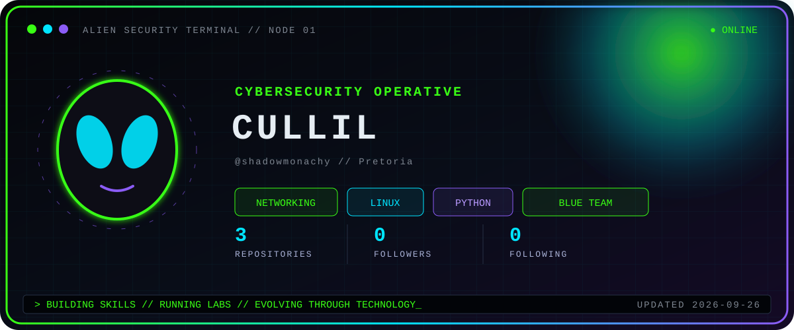

<div align="center">

# 👽 SHADOWMONACHY

### `SYSTEM ONLINE`

**Cybersecurity Learner • Networking • Linux • Python**

> Building skills. Running labs. Evolving through technology.

</div>

___
<p align="center">
  
  
  
  
  
</p>

---
## 👾 OPERATOR PROFILE

```text
Username:     shadowmonachy
Location:     Pretoria, South Africa
Current Path: Networking and Cybersecurity
Learning:     Linux, Python, Cisco and Security Operations
Goal:         Security Engineer / Purple Team
Status:       SYSTEM ONLINE
```
---

## 🛸 CURRENT MISSIONS

- Learning networking from first principles
- Practising Linux and Bash commands
- Building Python skills
- Creating Cisco Packet Tracer labs
- Developing cybersecurity and blue-team knowledge
- Working toward becoming a Security Engineer
  ---
## ⚡ TECHNOLOGY ARSENAL

<p align="center">


</p>
---
## 🧪 ACTIVE LABS

```text
[01] Cisco Packet Tracer Projects
[02] Linux Terminal Drills
[03] Python Practice
[04] Wireshark Traffic Analysis
[05] Networking Fundamentals
[06] Cybersecurity Notes
```
---
## 📡 SYSTEM ACTIVITY

<p align="center">
  
</p>
